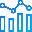
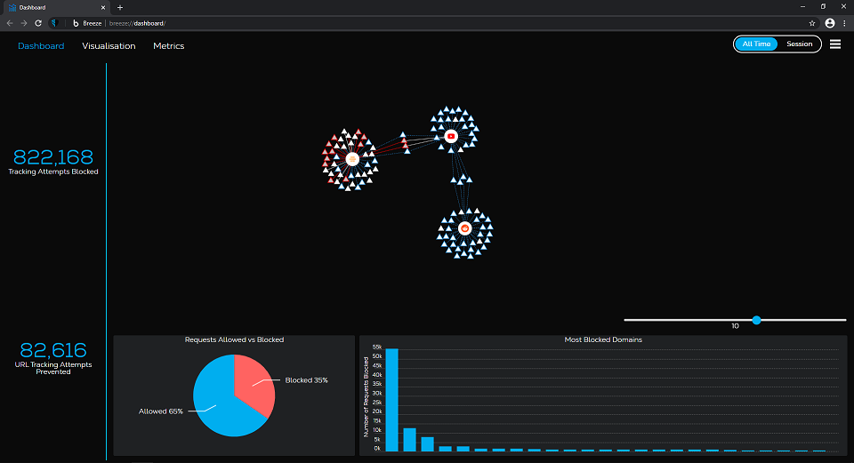
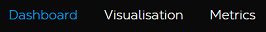
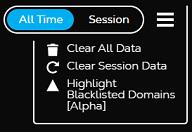

# Dashboard

Dashboard provides users with a simple yet informative view of their browsing data.

## Description

Dashboard is an interactive page within Breeze that displays and updates your blocking statistics & website relationships in real time.

It can be accessed either through the [`PMC`](../../../privacy-master-controller) popup or directly by visiting [breeze://dashboard](breeze://dashboard). Dashboard is divided into two sections (a third section is in plans for the future), both of which can be a good insight into some of your browsing statistics and relationships between sites you've visited.

## Interface

The header provides users with a choice between displaying:

- Dashboard

  The landing page that is shown when users visit Dashboard. It provides a set of browsing / blocking metrics as well as a smaller view of the Visualisation tab.

- Visualisation

  An unobscured view of the interactive display of visited websites and their third party connections as well as a legend to explain the color-coding for the elements displayed. Explained in detail under the section [Visualisation](#visualisation)

- Metrics

  Currently a WIP page planned to provide users with detailed browsing and blocking metrics.

Users may also choose between having the data displayed be <b>All Time</b> or <b>Session</b> as well as clear the data or enable an experimental feature that will be explained later.

### Visualisation

In Dashboard, users can easily view which third party domains each website they visit connects to.

Every visited website (first party) is represented as a circle, while the third parties it connects to are represented as triangles. Some websites have the same third party connections and that could be useful information for users concerned about the possible sharing of their information between websites.

The Visualisation tab shows a fullscreen view of the graph accompanied by a legend explaining the types of connections and third parties displayed.

All third parties and connections to them are preserved and displayed but their types are updated only when a connection to them is opened again.

##### Highlight Blacklisted Domains

This is a feature still in an alpha phase. Enabling it highlights all third party connections that would have been blocked if [`PMC`](../../../privacy-master-controller) had been active. This feature requires some browsing to be done with it being active.

#### Thunderbeam - Lightbeam for Chrome

_"[Thunderbeam - Lightbeam for Chrome](https://github.com/socsys/Lightbeam_Chrome/) is a browser extension that visualizes relationships between third parties and sites you visit."_

This extension provides the graph-like representation of visited sites and their third party connections that is displayed on Dashboard.

##### Integration into Breeze

Changes made to the original extension can be summed up as:

- Removed all code related to submitting data for research purposes.
- Modified the files `/js/capture.js`, `/js/store.js`, `/js/lightbeam.js` and `/js/viz.js` to provide communication with other supporting extensions and [`PMC`](../../../privacy-master-controller) as well as to implement certain Breeze additions to the graph-like display and its accompanying data.

## License

See [LICENSE](LICENSE)
